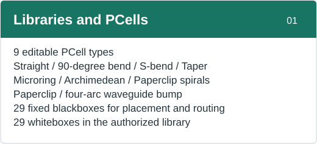
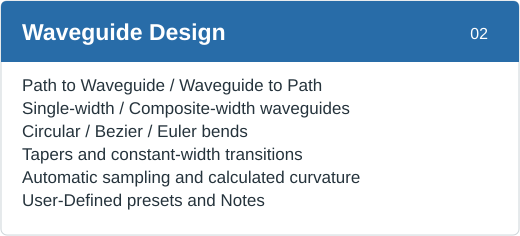
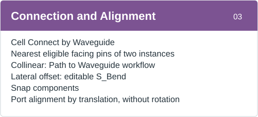
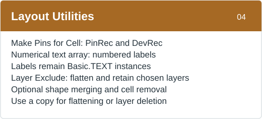
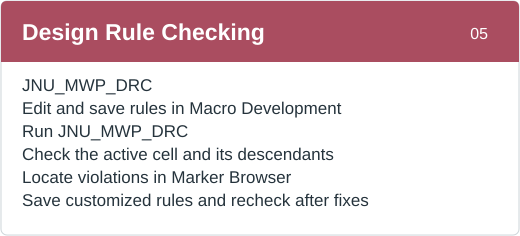
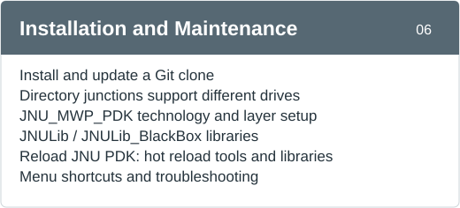

  
  

# JNU-MWP-SOI-PDK

A KLayout silicon photonics PDK from Jinan University's Optoelectronic Hybrid Integration Laboratory. It provides the `JNU_MWP_PDK` technology, parametric `JNULib`, fixed-device `JNULib_BlackBox`, waveguide tools, and DRC. The public repository works independently with nine PCell types and 30 fixed blackboxes; 29 fixed whitebox GDS files are available through a separately authorized library.

## Installation and updates

### Windows: install from KLayout

Install KLayout and [Git](https://git-scm.com/downloads) first.

1. **[Download Install_JNU_PDK.lym](https://github.com/Jerry-behappy/JNU-MWP-SOI-PDK/releases/download/installer-macro/Install_JNU_PDK.lym)**.
2. Drop the `.lym` file into the KLayout you normally use. In **Macro Development**, select **Install JNU PDK**, click the green **Run** button, then **安装 (Install)**.
3. Restart KLayout, select the `JNU_MWP_PDK` technology, and confirm the top-level menu and both libraries appear.

The macro reads KLayout's actual user directory, clones the default branch, and creates a directory junction; KLayout and the source clone may reside on different drives. You can also use the AI installation prompt below.

### Install or update with an AI agent

Copy these prompts into an AI agent **that can access local files and run commands**. It should inspect the current installation and preserve other PDKs, private GDS, and local changes.

**Installation prompt**

> Install https://github.com/Jerry-behappy/JNU-MWP-SOI-PDK in the KLayout I normally use. Find KLayout's actual user directory and install through a Git clone and directory junction. Preserve existing PDKs, private GDS, and local changes. Restart afterward and verify the technology, libraries, and function menu.

**Update prompt**

> Update the JNU-MWP-SOI-PDK installed in my current KLayout. Find the active Git clone and safely fast-forward its current branch. Preserve local changes and private GDS. Verify the libraries and menu afterward, and tell me whether a restart is required.

### Updates, language, and whiteboxes

- A `main` installation checks GitHub for updates at startup. Click **Update now** in the prompt or use **JNU_MWP_PDK → Check for PDK Updates**. Development branches do not show automatic update prompts. Restart KLayout after updating.
- Choose **JNU_MWP_PDK → Language → English / 简体中文** to change menu and PCell parameter labels; the change takes effect **after a restart**. **Reload JNU PDK** can reload Python tools, but changes to startup macros, technology, or installation paths still require a restart.
- Authorized users can choose **JNU_MWP_PDK → Install / Update Whitebox Library** to install 29 fixed whiteboxes from the separate [JNU-MWP-SOI-Library](https://github.com/Jerry-behappy/JNU-MWP-SOI-Library). This public PDK repository contains no whitebox GDS.

## Features and user guide

**Click any card below to open its section in the [detailed user guide](docs/USER_GUIDE.md#english-user-guide).**

<table>
  <tr><th colspan="2">JNU-MWP-SOI-PDK · Feature Map</th></tr>
  <tr>
    <td width="50%"></td>
    <td width="50%"></td>
  </tr>
  <tr>
    <td width="50%"></td>
    <td width="50%"></td>
  </tr>
  <tr>
    <td width="50%"></td>
    <td width="50%"></td>
  </tr>
</table>

[Report an issue](https://github.com/Jerry-behappy/JNU-MWP-SOI-PDK/issues) · [License](LICENSE.md)
