# JNU-MWP-SOI-PDK

## 中文说明

`JNU-MWP-SOI-PDK` 是暨南大学光电混合集成实验室使用的硅光 PDK 项目。当前仓库以开发源码形式发布，包含 `JNU_MWP_PDK` technology、KLayout 菜单、DRC、PCell、固定黑盒器件和图层配置。白盒 GDS 保持私有，仅在实验室内授权分发。

> [!IMPORTANT]
> **使用过程中遇到 Bug，欢迎[提交 Issues](https://github.com/Jerry-behappy/JNU-MWP-SOI-PDK/issues)。**

### 功能概览

该 PDK 支持在 KLayout 中进行硅光器件放置与参数化设计，包括直波导、90° 弯曲、S 弯、Taper、双总线微环和多种螺旋延迟线；提供 Circular、Bezier、Euler 弯曲，以及单宽度和复合宽度波导的路径转换。借助 PinRec 端口识别，可自动连接两个器件或进行端口吸附，并完成端口生成、编号文字阵列、图层筛选与展平、当前 Cell 及其子层级的 DRC 检查。功能菜单还支持自定义波导预设和 PDK 热重载；固定黑盒器件可用于布局与连线，实际器件内部结构需另行取得授权白盒 GDS。

**点击下方任意功能框，直接跳转到对应的使用说明章节。**

<table>
  <tr><th colspan="2"><a href="docs/USER_GUIDE.md#中文使用说明">JNU-MWP-SOI-PDK · 功能框图</a></th></tr>
  <tr>
    <td width="50%"><a href="docs/USER_GUIDE.md#2-器件与参数" title="器件库与参数化设计">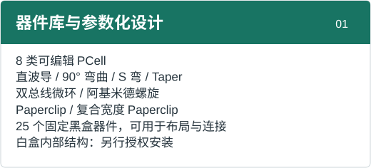</a></td>
    <td width="50%"><a href="docs/USER_GUIDE.md#5-绘制与修改波导" title="波导设计">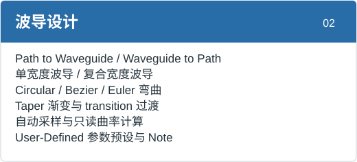</a></td>
  </tr>
  <tr>
    <td width="50%"><a href="docs/USER_GUIDE.md#6-连接与吸附器件" title="器件连接与对齐">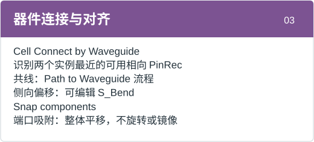</a></td>
    <td width="50%"><a href="docs/USER_GUIDE.md#7-端口文字与图层处理" title="版图辅助">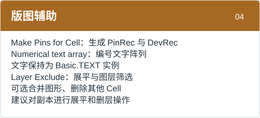</a></td>
  </tr>
  <tr>
    <td width="50%"><a href="docs/USER_GUIDE.md#8-drc-检查" title="设计规则检查">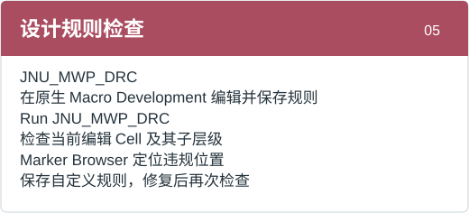</a></td>
    <td width="50%"><a href="docs/USER_GUIDE.md#10-安装与维护" title="安装与维护">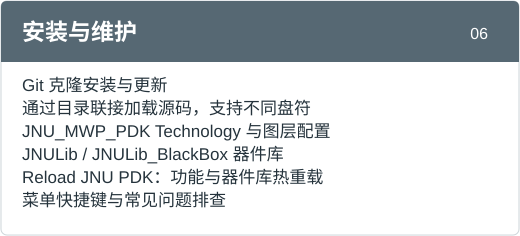</a></td>
  </tr>
</table>

### [点击查看详细使用说明](docs/USER_GUIDE.md)

包含入门步骤、PCell 功能、波导绘制与连接、菜单快捷键、DRC 和常见问题。

### 推荐安装与更新方式

使用能够访问本机文件并执行命令的 AI agent，按下文的克隆仓库流程完成安装或更新。

**推荐安装方式**：在 AI agent 中输入：

> 请在本机的 KLayout 中安装该项目：https://github.com/Jerry-behappy/JNU-MWP-SOI-PDK 。先确认 KLayout 实际使用的用户配置目录，不要根据程序所在盘符猜测安装位置，并保留已有 PDK 和私有 GDS。

**推荐更新方式**：在 AI agent 中输入：

> 请在本机的 KLayout 中更新该项目：https://github.com/Jerry-behappy/JNU-MWP-SOI-PDK 。先定位当前安装联接指向的 Git 克隆目录，并保留本地修改和私有 GDS。

### 仓库内容

- `salt/JNU_MWP_PDK/`：KLayout salt 包主体，包含菜单、PCell、工具、DRC 和图层配置。
- `salt/JNU_MWP_PDK/JNU_MWP_PDK.lyt`：唯一维护的 technology 配置，由包内启动宏自动注册。
- `salt/JNU_MWP_PDK/layers.lyp`：JNU PDK 图层显示配置。
- `salt/JNU_MWP_PDK/drc/JNU_MWP_DRC.lydrc`：JNU DRC 规则入口。
- `salt/JNU_MWP_PDK/pymacros/JNU_MWP_pcells/`：JNU PCell 源码。
- `salt/JNU_MWP_PDK/pymacros/JNU_MWP_blackbox_gds/`：随仓库提供的 25 个固定黑盒器件 GDS。
- `salt/JNU_MWP_PDK/pymacros/JNU_MWP_tools/`：JNU 菜单功能和公共工具源码。
- `salt/JNU_MWP_PDK/pymacros/JNU_MWP_skill/`：项目内部维护用 skill，不用于黑盒发布包。

### 推荐：拖入 KLayout 安装（Windows）

**[下载安装宏 Install_JNU_PDK.lym](https://raw.githubusercontent.com/Jerry-behappy/JNU-MWP-SOI-PDK/main/Install_JNU_PDK.lym)**（浏览器若显示源码，请右键链接“另存为”，保留 `.lym` 扩展名）。

1. 打开平时使用的 KLayout，将下载的 `.lym` 文件拖入主窗口。
2. 在 Macro Development 中选中 **Install JNU PDK**，点击绿色 Run，再点击“安装”。
3. 等待提示完成，保存版图并重启 KLayout；选择 `JNU_MWP_PDK` Technology。

**无需查找 KLayout 程序或用户配置目录，也不需要输入 PowerShell 命令。** 安装宏从正在运行的 KLayout 自动读取实际目录，后台克隆 GitHub `main`，并建立目录联接。首次安装需要 [Git](https://git-scm.com/downloads)；未安装时可点击窗口中的 **Install Git**，安装后重新打开 KLayout。

默认源码保存在 `<实际用户配置目录>/jnu_repositories/JNU-MWP-SOI-PDK`，请保留此目录。已有正确的克隆联接会被复用；检测到旧手动安装、旧 loader、本地修改或非 `main` 分支时会保留现有数据并提示处理原因。网络失败时可以重试；若 Git 留下不完整克隆，先将该目录移至配置目录外保留，再重新安装。

后续更新点击 **JNU_MWP_PDK → Check for PDK Updates**。授权白盒器件使用 **Install / Update Whitebox Library**，具体授权说明见下方。

<details>
<summary>高级安装：手动克隆与 PowerShell（已有自定义目录时使用）</summary>

本项目仅支持 Git 克隆及目录联接安装。KLayout 程序、源码克隆目录和用户配置目录可以位于不同盘符。

> [!IMPORTANT]
> **不要求 KLayout 安装在 C 盘。PDK 应安装到 KLayout 实际使用的用户配置目录，不是 `klayout_app.exe` 所在目录。**
> 程序位于 D/E 盘，不代表用户配置目录也在该盘；用户目录也不一定在 C 盘。

#### 确认用户配置目录

在本机实际使用的 KLayout 中，打开 Macro Development 的 Python 控制台，执行：

```python
print(pya.Application.instance().application_data_path())
```

记下输出目录，再关闭 KLayout。安装脚本按以下优先级确定目标：`-KLayoutHome` 显式参数 → `KLAYOUT_HOME` 环境变量 → `%USERPROFILE%\KLayout`。如使用便携版、定制启动脚本或 `KLAYOUT_PATH`，请以刚才查询的实际目录为准，不要猜测。

#### 默认用户目录安装

安装 Git，并确认查询结果与脚本默认用户目录一致后，在 PowerShell 执行。源码可以克隆到任意可写的本地盘，下面仅以当前用户目录为例：

```powershell
git clone https://github.com/Jerry-behappy/JNU-MWP-SOI-PDK.git "$env:USERPROFILE\JNU-MWP-SOI-PDK"
powershell -NoProfile -ExecutionPolicy Bypass -File "$env:USERPROFILE\JNU-MWP-SOI-PDK\Install_Cloned_PDK.ps1" -WhatIf
powershell -NoProfile -ExecutionPolicy Bypass -File "$env:USERPROFILE\JNU-MWP-SOI-PDK\Install_Cloned_PDK.ps1"
```

安装脚本创建目录联接，直接加载克隆目录中的源码，而不是再复制一份：

```text
<KLayout 实际用户配置目录>\salt\JNU_MWP_PDK
  -> <Git 克隆目录>\salt\JNU_MWP_PDK
```

`-WhatIf` 只预览，不创建目录。核对输出中的 `KLAYOUT_USER_HOME` 后，再运行不带 `-WhatIf` 的命令。

#### 自定义用户目录或 D/E 盘安装

例如源码克隆在 `E:\Photonics\JNU-MWP-SOI-PDK`，且 KLayout 查询结果是 `D:\KLayoutUser`，执行以下命令；请把两处路径替换为自己机器上的实际值：

```powershell
powershell -NoProfile -ExecutionPolicy Bypass -File "E:\Photonics\JNU-MWP-SOI-PDK\Install_Cloned_PDK.ps1" -KLayoutHome "D:\KLayoutUser" -WhatIf
powershell -NoProfile -ExecutionPolicy Bypass -File "E:\Photonics\JNU-MWP-SOI-PDK\Install_Cloned_PDK.ps1" -KLayoutHome "D:\KLayoutUser"
```

**`-KLayoutHome` 只指定 PDK 安装目标，不会修改 KLayout 使用的用户目录，也不会设置环境变量。填写不存在于当前 KLayout 配置中的新目录，不会让 KLayout 自动加载它。** 已克隆过仓库时只需运行其安装脚本，不必重复克隆。

启动宏自动加载 `salt/JNU_MWP_PDK/JNU_MWP_PDK.lyt` 及同目录的 `layers.lyp`，完成技术注册和图层配置。仓库根目录不再维护重复的 `tech/`。
请勿把整个仓库放入 `KLayout/salt/`，否则可能重复扫描源码。
若已有其他 `salt/JNU_MWP_PDK` 安装、旧版 `tech/JNU_MWP_PDK` 副本或独立 JNU loader，脚本会停止并保留现有文件；指向同一克隆目录的联接可重复运行安装脚本。
请关闭 KLayout，先把旧安装移至 KLayout 目录以外备份，再重试；不要删除白盒 GDS 或修改其他 PDK。
克隆目录需要长期保留，移动或删除它会使目录联接失效。

</details>

安装完成并重启后，应能看到：

- Technology：`JNU_MWP_PDK`
- 顶部功能菜单：`JNU_MWP_PDK`
- 器件库：`JNULib`、`JNULib_BlackBox`

`JNULib` 提供 8 类可编辑 PCell；`JNULib_BlackBox` 自动加载仓库自带的 25 个固定黑盒器件，无需另行取得白盒 GDS。选择 `Instance → JNULib_BlackBox` 即可放置器件。黑盒覆盖 1310/1550 nm 的光栅耦合器、端面耦合器、MMI、分光器、偏振分束器、偏振旋转器、偏振器、光开关和终端器件。

黑盒只保留器件占位矩形、PinRec 端口、DevRec 边界和名称标签，不包含内部物理结构。这些占位图形用于布局与连接，不能直接作为最终流片的器件结构。

### 更新与白盒 GDS

推荐点击 **JNU_MWP_PDK → Check for PDK Updates**，工具会定位当前安装联接对应的克隆，检查干净的 `main` 并只执行快进更新。完成后保存版图并重启 KLayout。旧版没有该菜单时可使用安装宏更新 Git 克隆版，或在克隆目录执行以下备用命令：

```powershell
git -C "$env:USERPROFILE\JNU-MWP-SOI-PDK" pull --ff-only origin main
```

如果源码克隆在 D/E 盘，把 `-C` 后的路径换成实际克隆目录；不要在 KLayout 程序目录或其他安装副本中执行更新。

随后重启 KLayout；仅修改 Python 功能时也可使用 `Reload JNU PDK`。目录联接使更新直接作用于实际安装，无需重复复制。
遇到本地修改或分支分歧时先处理并保留自己的修改，不要使用强制重置。重要版图在升级 PCell 代码前应备份。

白盒 GDS 来自私有仓库 `Jerry-behappy/JNU-MWP-SOI-Library`，需单独授权获取；不会随本仓库克隆或更新。
获授权后点击 **JNU_MWP_PDK → Install / Update Whitebox Library**。Git 使用本机已有凭据，或由 Git Credential Manager 弹出 GitHub 登录；安装器不收集密码或 token。若认证失败，请先在 Git Credential Manager 中完成 GitHub 登录并确认账户已被授予私有仓库访问权，再重试。
私有库会单独克隆到 `<实际用户配置目录>/jnu_private`，之后再次点击同一菜单即可更新。已有手动放置的 `jnu_private` 不会被覆盖；此时可继续手动维护，或先备份后迁移。也可将获授权的 `JNU_MWP_gds` 内容手动放入用户目录 `jnu_private/JNU_MWP_gds`，重启后在 `JNULib` 中使用。
既有源码目录中的 `pymacros/JNU_MWP_gds` 仍兼容加载。不要将任何白盒 GDS 提交到本仓库。

### 重要说明

本项目基于 Lukas Chrostowski 及贡献者的原始项目开发。推荐同时安装 [SiEPIC EBeam PDK](https://github.com/SiEPIC/SiEPIC_EBeam_PDK) 搭配使用。原始 MIT 许可证及版权声明已被保留，详见根目录的 `LICENSE.md`。

> [!IMPORTANT]
> **本项目用于存放固定白盒器件 GDS 的本地源码目录为：**
>
> ```text
> salt/JNU_MWP_PDK/pymacros/JNU_MWP_gds/
> ```
>
> **该目录已通过 `.gitignore` 排除，白盒 GDS 不随本仓库公开上传。**
>
> **如需白盒 GDS，请与实验室联系。**

仓库中的黑盒 GDS 可独立加载，PCell 源码继续保留。维护者可运行 `salt/JNU_MWP_PDK/pymacros/JNU_MWP_tools/release/export_blackbox_gds.py --source <本地白盒目录> --output <新的黑盒目录>` 更新黑盒数据。若只需分发黑盒器件而不携带 PCell 源码，请使用独立黑盒打包流程。

运行过程中生成的 `klayoutrc*`、`__pycache__`、`.pyc`、`.pyo`、日志文件等不会纳入版本控制。

---

## English Description

`JNU-MWP-SOI-PDK` is a silicon photonics PDK project used by the Optoelectronic Hybrid Integration Laboratory at Jinan University. This repository provides the development source, technology, menus, DRC, PCells, fixed blackbox devices and layer configuration. Whitebox GDS remains private and is distributed only to authorized laboratory users.

> [!IMPORTANT]
> **Found a bug? Please [submit an issue](https://github.com/Jerry-behappy/JNU-MWP-SOI-PDK/issues).**

### Capabilities

The PDK supports silicon-photonic layout and parametric device design in KLayout, including straight waveguides, 90-degree bends, S-bends, tapers, double-bus microrings, and spiral delay lines. It provides Circular, Bezier, and Euler bends, reversible path conversion for single-width and composite-width waveguides, PinRec-based device connections and snapping, pin creation, numbered text arrays, layer filtering and flattening, and DRC of the active cell and its descendants. Saved waveguide presets and PDK hot reload support repeated design work. Bundled blackboxes provide placement and connectivity references; actual internal device geometry requires separately authorized whitebox GDS.

**Click any functional block to open its corresponding user-guide section.**

<table>
  <tr><th colspan="2"><a href="docs/USER_GUIDE.md#english-user-guide">JNU-MWP-SOI-PDK · Feature Map</a></th></tr>
  <tr>
    <td width="50%"><a href="docs/USER_GUIDE.md#device-libraries" title="Libraries and PCells">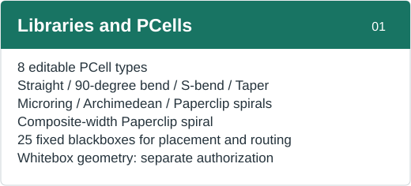</a></td>
    <td width="50%"><a href="docs/USER_GUIDE.md#waveguide-workflow" title="Waveguide Design">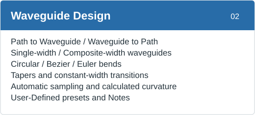</a></td>
  </tr>
  <tr>
    <td width="50%"><a href="docs/USER_GUIDE.md#connecting-and-arranging-devices" title="Connection and Alignment">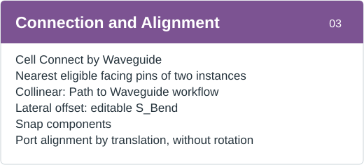</a></td>
    <td width="50%"><a href="docs/USER_GUIDE.md#layout-utilities" title="Layout Utilities">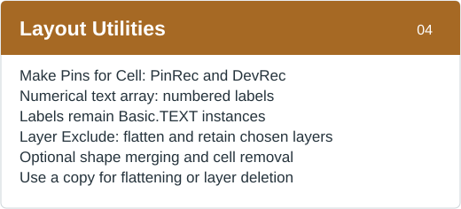</a></td>
  </tr>
  <tr>
    <td width="50%"><a href="docs/USER_GUIDE.md#drc-and-troubleshooting" title="Design Rule Checking">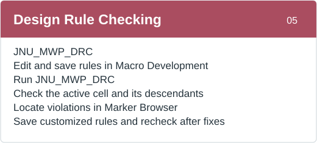</a></td>
    <td width="50%"><a href="docs/USER_GUIDE.md#installation-and-maintenance" title="Installation and Maintenance">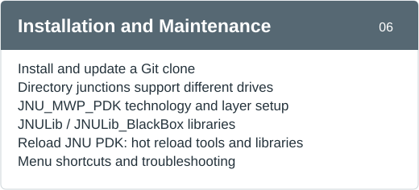</a></td>
  </tr>
</table>

### [Read the detailed user guide](docs/USER_GUIDE.md#english-user-guide)

Covers getting started, PCells, waveguide routing, menu shortcuts, DRC, and troubleshooting.

### Recommended Installation and Updates

Use an AI agent that can access local files and run commands, following the Git clone workflow below.

**Recommended installation**: enter this prompt in the AI agent:

> Please install this project in KLayout on this computer: https://github.com/Jerry-behappy/JNU-MWP-SOI-PDK . First determine the actual KLayout user directory; do not infer it from the executable location. Preserve existing PDKs and private GDS.

**Recommended update**: enter this prompt in the AI agent:

> Please update this project in KLayout on this computer: https://github.com/Jerry-behappy/JNU-MWP-SOI-PDK . First locate the Git clone targeted by the current installation junction. Preserve local changes and private GDS.

### Repository Contents

- `salt/JNU_MWP_PDK/`: main KLayout salt package, including menus, PCells, tools, DRC, and layer configuration.
- `salt/JNU_MWP_PDK/JNU_MWP_PDK.lyt`: the single maintained technology configuration, registered automatically by the package startup macro.
- `salt/JNU_MWP_PDK/layers.lyp`: JNU PDK layer display configuration.
- `salt/JNU_MWP_PDK/drc/JNU_MWP_DRC.lydrc`: JNU DRC entry script.
- `salt/JNU_MWP_PDK/pymacros/JNU_MWP_pcells/`: JNU PCell source code.
- `salt/JNU_MWP_PDK/pymacros/JNU_MWP_blackbox_gds/`: 25 bundled fixed blackbox device GDS files.
- `salt/JNU_MWP_PDK/pymacros/JNU_MWP_tools/`: JNU menu actions and shared utility code.
- `salt/JNU_MWP_PDK/pymacros/JNU_MWP_skill/`: internal project skill used for maintenance, not included in blackbox release packages.

### Recommended: Drag-and-Drop Installer (Windows)

**[Download Install_JNU_PDK.lym](https://raw.githubusercontent.com/Jerry-behappy/JNU-MWP-SOI-PDK/main/Install_JNU_PDK.lym)**. If the browser displays source code, use **Save link as** and keep the `.lym` extension.

1. Open the KLayout you normally use and drop the downloaded macro onto its main window.
2. Select **Install JNU PDK** in Macro Development, click the green Run button, then click **安装 (Install)**.
3. Wait for completion, save your layouts, restart KLayout, and select the `JNU_MWP_PDK` technology.

**No executable path, configuration-directory lookup, or PowerShell command is required.** The macro reads the running application's data directory, clones GitHub `main` in the background, and creates a directory junction. [Git](https://git-scm.com/downloads) is required; the installer provides an **Install Git** link. Restart KLayout after installing Git.

The default checkout is `<actual user directory>/jnu_repositories/JNU-MWP-SOI-PDK`; keep it in place. An existing valid checkout junction is reused. Legacy installations, local edits, and non-main branches are preserved and reported. If a failed clone leaves an incomplete directory, move it outside the configuration directory before retrying.

For later updates use **JNU_MWP_PDK → Check for PDK Updates**. Authorized whitebox devices have a separate **Install / Update Whitebox Library** entry.

<details>
<summary>Advanced: manual Git clone and PowerShell installation</summary>

This project supports installation only through a Git clone and a directory junction.
The executable, Git clone, and KLayout user directory may be on different drives.

> [!IMPORTANT]
> **KLayout does not need to be installed on C:. Install the PDK in KLayout's actual user directory, not the directory containing `klayout_app.exe`.**
> An executable on D: or E: does not imply the same drive for user data, and the user directory is not necessarily on C:.

#### Find the User Directory

In the KLayout installation you actually use, open the Python console in Macro Development and run:

```python
print(pya.Application.instance().application_data_path())
```

Record the output and close KLayout. The installer resolves its target in this order: explicit `-KLayoutHome`, the `KLAYOUT_HOME` environment variable, then `%USERPROFILE%\KLayout`. For portable installations, custom launch scripts, or `KLAYOUT_PATH`, use the queried directory rather than guessing.

#### Default User Directory

Install Git and confirm that the queried path matches the installer's default user directory. Then run in PowerShell. The clone can be on any writable local drive; this example uses the current user's directory:

```powershell
git clone https://github.com/Jerry-behappy/JNU-MWP-SOI-PDK.git "$env:USERPROFILE\JNU-MWP-SOI-PDK"
powershell -NoProfile -ExecutionPolicy Bypass -File "$env:USERPROFILE\JNU-MWP-SOI-PDK\Install_Cloned_PDK.ps1" -WhatIf
powershell -NoProfile -ExecutionPolicy Bypass -File "$env:USERPROFILE\JNU-MWP-SOI-PDK\Install_Cloned_PDK.ps1"
```

The installer creates a directory junction so KLayout loads the clone directly:

```text
<actual KLayout user directory>\salt\JNU_MWP_PDK
  -> <Git clone directory>\salt\JNU_MWP_PDK
```

`-WhatIf` previews the operation without creating directories. Check `KLAYOUT_USER_HOME` before running the command without `-WhatIf`.

#### Custom User Directory or D:/E: Installation

For example, with a clone at `E:\Photonics\JNU-MWP-SOI-PDK` and a queried KLayout user directory of `D:\KLayoutUser`, run the following. Replace both paths with the actual locations on your machine:

```powershell
powershell -NoProfile -ExecutionPolicy Bypass -File "E:\Photonics\JNU-MWP-SOI-PDK\Install_Cloned_PDK.ps1" -KLayoutHome "D:\KLayoutUser" -WhatIf
powershell -NoProfile -ExecutionPolicy Bypass -File "E:\Photonics\JNU-MWP-SOI-PDK\Install_Cloned_PDK.ps1" -KLayoutHome "D:\KLayoutUser"
```

**`-KLayoutHome` only selects the PDK installation target. It does not reconfigure KLayout's user directory or change environment variables. Choosing an arbitrary new directory does not make KLayout load it.** For an existing clone, only run its installer; do not clone again.

The startup macro loads
`salt/JNU_MWP_PDK/JNU_MWP_PDK.lyt` and the adjacent `layers.lyp` to register the
technology and configure layers. The repository no longer maintains a duplicate
root `tech/` directory.
Do not clone the whole repository under `KLayout/salt/`. Other existing PDK
installations, legacy `tech/JNU_MWP_PDK` copies, and standalone JNU loaders are
preserved: close KLayout and back them up outside KLayout before retrying.
Rerunning the installer for a junction to the same clone is supported.
Preserve private GDS and other PDKs. Keep the clone at its installed location;
moving or deleting it breaks the junction.

</details>

Restart KLayout. After successful loading, KLayout should show:

- Technology: `JNU_MWP_PDK`
- Top-level menu: `JNU_MWP_PDK`
- Libraries: `JNULib`, `JNULib_BlackBox`

`JNULib` provides eight editable PCell types. `JNULib_BlackBox` automatically loads 25 bundled fixed blackbox devices without requiring whitebox GDS. Use `Instance → JNULib_BlackBox` to place them. The devices cover 1310/1550 nm grating and edge couplers, MMIs, splitters, polarization beam splitters, a polarization rotator, polarizers, optical switches, and a terminator.

Blackboxes retain only a rectangular footprint, PinRec ports, DevRec bounds, and a name label. They omit internal physical geometry and are layout/connectivity placeholders, not final fabrication geometry.

### Updates and Whitebox GDS

Use **JNU_MWP_PDK → Check for PDK Updates**. It resolves the active checkout, requires a clean `main`, and applies only a fast-forward update. Save layouts and restart afterwards. Older installations can rerun the installer macro for an existing Git-based installation or use this fallback command:

```powershell
git -C "$env:USERPROFILE\JNU-MWP-SOI-PDK" pull --ff-only origin main
```

For a clone on D: or E:, replace the argument after `-C` with its actual location. Do not update an unrelated copy or run this command in the KLayout executable directory.

Restart KLayout; Python-only changes may also use Reload JNU PDK. The junction
removes the need to copy updated files. Preserve local changes and resolve branch
divergence instead of forcing a reset. Back up important layouts before PCell upgrades.

Whitebox GDS requires separate authorization to `Jerry-behappy/JNU-MWP-SOI-Library`.
Use **JNU_MWP_PDK → Install / Update Whitebox Library** after access is granted. Git uses your existing credentials or Git Credential Manager's GitHub login; the installer never collects passwords or tokens. If authentication fails, sign in with Git Credential Manager and verify repository access before retrying. The private checkout lives in `<actual user directory>/jnu_private`; the same menu updates it later. Existing manual private data is preserved and requires backup before migration.
Alternatively put authorized extracted GDS in `<KLayout user home>/jnu_private/JNU_MWP_gds`
and restart/reload. Legacy `pymacros/JNU_MWP_gds` remains supported. Public code
updates do not update private GDS. Never commit whitebox GDS to this repository.

### Notes

This project is based on the original project by Lukas Chrostowski and contributors. We recommend also installing the [SiEPIC EBeam PDK](https://github.com/SiEPIC/SiEPIC_EBeam_PDK) for use alongside this project. The original MIT license and copyright notices have been retained. See `LICENSE.md` in the repository root.

> [!IMPORTANT]
> **The local source directory for fixed whitebox device GDS is:**
>
> ```text
> salt/JNU_MWP_PDK/pymacros/JNU_MWP_gds/
> ```
>
> **This directory is excluded by `.gitignore`; whitebox GDS is not published in this repository.**
>
> **Please contact the laboratory if you need whitebox GDS.**

Bundled blackbox GDS loads independently, and PCell source code remains included. Maintainers can run `salt/JNU_MWP_PDK/pymacros/JNU_MWP_tools/release/export_blackbox_gds.py --source <local-whitebox-directory> --output <new-blackbox-directory>` to refresh the blackbox data. To distribute blackboxes without PCell source code, use the separate blackbox packaging workflow.

Generated files such as `klayoutrc*`, `__pycache__`, `.pyc`, `.pyo`, and log files are not tracked by version control.
