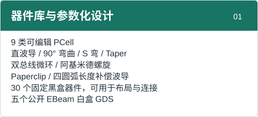
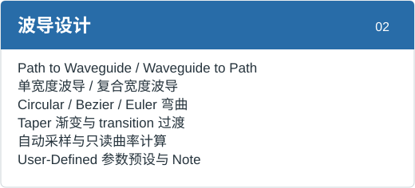
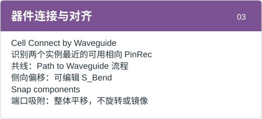
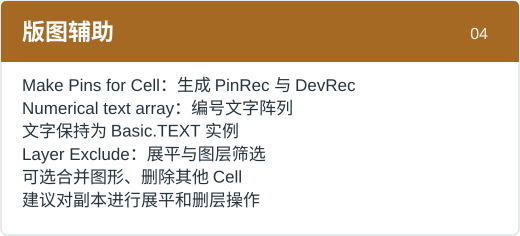
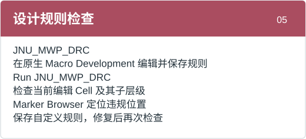
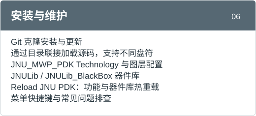

  
  

# JNU-MWP-SOI-PDK

暨南大学光电混合集成实验室的 KLayout 硅光 PDK，提供 `JNU_MWP_PDK` Technology、参数化 `JNULib`、固定器件 `JNULib_BlackBox`、波导工具和 DRC。公开仓库可独立使用 9 类 PCell 与 30 个固定黑盒；29 份固定白盒 GDS 由独立器件库授权安装。

## 安装与更新

### Windows：拖入 KLayout 安装

首次安装需要 KLayout 和 [Git](https://git-scm.com/downloads)。

1. **[下载安装宏 Install_JNU_PDK.lym](https://github.com/Jerry-behappy/JNU-MWP-SOI-PDK/releases/download/installer-macro/Install_JNU_PDK.lym)**。
2. 将 `.lym` 拖入平时使用的 KLayout，在 **Macro Development** 中选择 **Install JNU PDK**，点击绿色 **Run**，再点击“安装”。
3. 完成后重启 KLayout，选择 `JNU_MWP_PDK` Technology，并确认顶部菜单及两个器件库已出现。

安装宏从正在运行的 KLayout 读取用户配置目录，克隆默认分支并建立目录联接，不要求 KLayout 与源码在同一盘。也可使用下方 AI 提示词安装。

### 用 AI 代理安装或更新

把下面的文字复制给**能够访问本机文件并执行命令**的 AI 代理。让它先检查现有安装，保留其他 PDK、私有 GDS 和本地改动。

**安装提示词**

> 请在我平时使用的 KLayout 中安装 https://github.com/Jerry-behappy/JNU-MWP-SOI-PDK 。确认实际使用的 KLayout 用户目录，通过 Git 克隆和目录联接安装；保留现有 PDK、私有 GDS 和本地修改。完成后重启并检查技术、器件库和功能菜单。

**更新提示词**

> 请更新我当前 KLayout 安装的 JNU-MWP-SOI-PDK。找到实际使用的 Git 克隆，仅对当前分支做安全的快进更新；保留本地修改和私有 GDS。更新后检查器件库与菜单，并说明是否需要重启。

### 更新、语言与白盒

- `main` 安装版每次启动会后台检查 GitHub 更新；发现新版可点击弹窗中的“立即更新”，也可使用 **JNU_MWP_PDK → Check for PDK Updates**。开发分支不自动提示更新；完成更新后重启 KLayout。
- 选择 **JNU_MWP_PDK → Language → English / 简体中文** 切换菜单和 PCell 参数标签，**重启后生效**。仅修改 Python 功能时可用 **Reload JNU PDK** 热重载；启动宏、Technology 或安装路径变动后仍应重启。
- 获授权后使用 **JNU_MWP_PDK → Install / Update Whitebox Library**，从独立 [JNU-MWP-SOI-Library](https://github.com/Jerry-behappy/JNU-MWP-SOI-Library) 安装 29 份固定白盒；公开 PDK 仓库不包含白盒 GDS。

## 功能与使用说明

**点击下方任意功能框，进入[详细使用说明](docs/USER_GUIDE.md#中文使用说明)的对应章节。** 以下菜单路径以默认 English 界面为例；切换为简体中文后，菜单名称会随之翻译。

<table>
  <tr><th colspan="2">JNU-MWP-SOI-PDK · 功能框图</th></tr>
  <tr>
    <td width="50%"></td>
    <td width="50%"></td>
  </tr>
  <tr>
    <td width="50%"></td>
    <td width="50%"></td>
  </tr>
  <tr>
    <td width="50%"></td>
    <td width="50%"></td>
  </tr>
</table>

[问题反馈](https://github.com/Jerry-behappy/JNU-MWP-SOI-PDK/issues) · [许可证](LICENSE.md)
